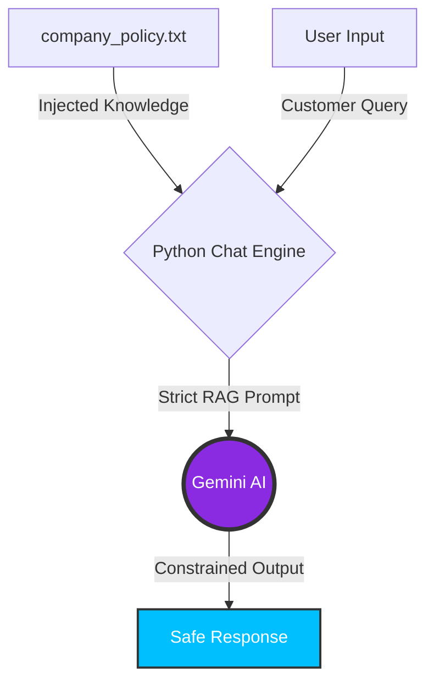

# Secure Corporate AI Assistant (Mini-RAG)

An interactive, terminal-based Customer Support AI designed with a strict "Zero-Hallucination" architecture. This project demonstrates how to constrain a Large Language Model (Google Gemini) to answer questions using *only* a provided company knowledge base, making it safe for enterprise deployment.

If a user asks about a policy, price, or product not explicitly mentioned in the internal documents, the AI is strictly prompted to deny the answer rather than guessing or using outside knowledge.

---

## System Architecture



---

## Key Features
- **Zero-Hallucination Prompting:** Utilizes advanced prompt engineering with data tagging (`<policy>`) to fence the AI's knowledge.
- **Interactive CLI:** Runs a continuous `while` loop to simulate a real-time chat interface directly in the terminal.
- **Fallback Mechanisms:** Automatically outputs a pre-defined safety message if the requested information is missing from the database.
- **Error Handling:** Gracefully handles missing files or API network errors without crashing.

---

## Project Structure
- `secure_ai_assistant.py` - The main Python script running the interactive chat loop.
- `company_policy.txt` - The mock internal database containing shipping, return, and support rules.
- `.env.example` - Template for secure API key management.

---

## VERSIONE ITALIANA (Presentazione Progetto)

### Assistente Aziendale Sicuro Anti-Allucinazione (Mini-RAG)
Il terrore di ogni azienda è che un bot AI prometta a un cliente un rimborso inesistente o inventi prezzi sbagliati. Questo progetto risolve esattamente questo problema alla radice.

### Il Vantaggio per l'Azienda
Questo script crea un "recinto" attorno all'Intelligenza Artificiale. Il bot legge un file con le regole aziendali (Knowledge Base) e risponde alle domande dei clienti **esclusivamente** basandosi su quel testo. Se un cliente chiede uno sconto non previsto, il bot si rifiuta di inventare una risposta e comunica che non ha l'informazione. È la base tecnologica per un Servizio Clienti automatizzato e sicuro al 100%.

### Competenze Tecniche Dimostrate:
- **Architettura RAG di base:** Inserimento di documenti esterni (TXT) all'interno del contesto dell'Intelligenza Artificiale.
- **Prompt Engineering Blindato:** Uso di tag XML per delimitare i dati e forzare il modello a disabilitare la sua "conoscenza generale" pregressa.
- **Sviluppo di Interfacce CLI:** Creazione di un'esperienza chat continua e interattiva tramite riga di comando.

---

## Installation & Setup

1. Clone this repository to your local machine.
2. Activate your Virtual Environment:
   ```bash
   .\venv\Scripts\activate
   ```
3. Install the required dependencies:
   ```bash
   pip install google-genai python-dotenv
   ```
4. Create a `.env` file in the root directory and securely add your Gemini API Key:
   ```text
   GEMINI_API_KEY=your_actual_api_key_here
   ```
5. Run the interactive assistant:
   ```bash
   python secure_ai_assistant.py
   ```
6. Type your questions or type `exit` to close the connection.
